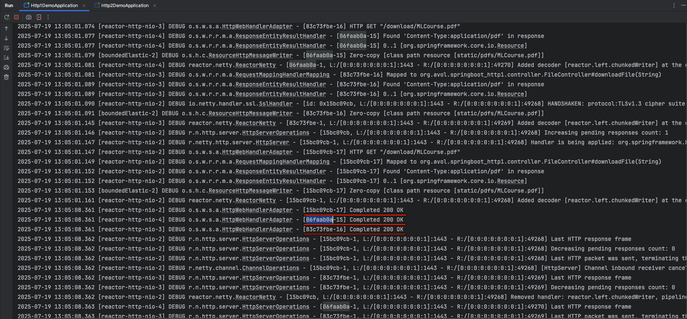
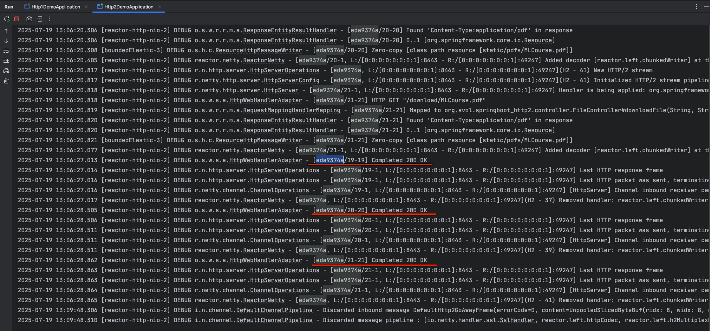
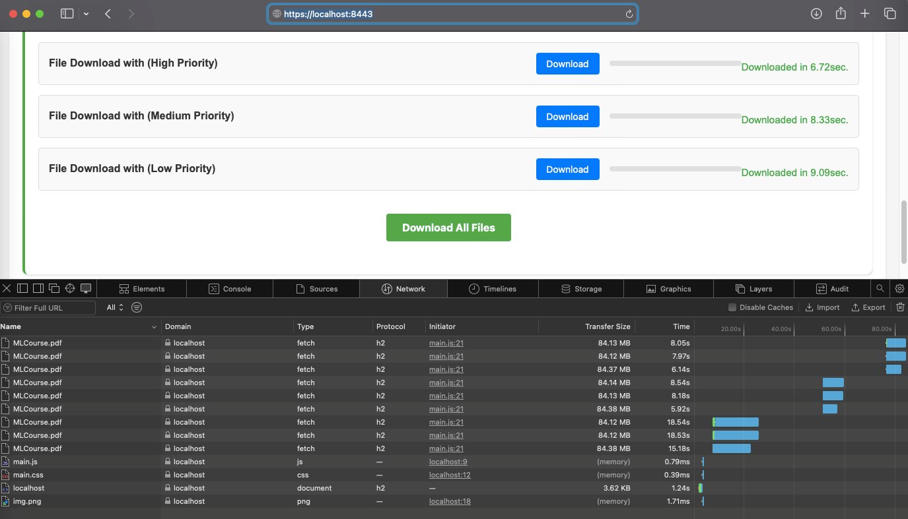
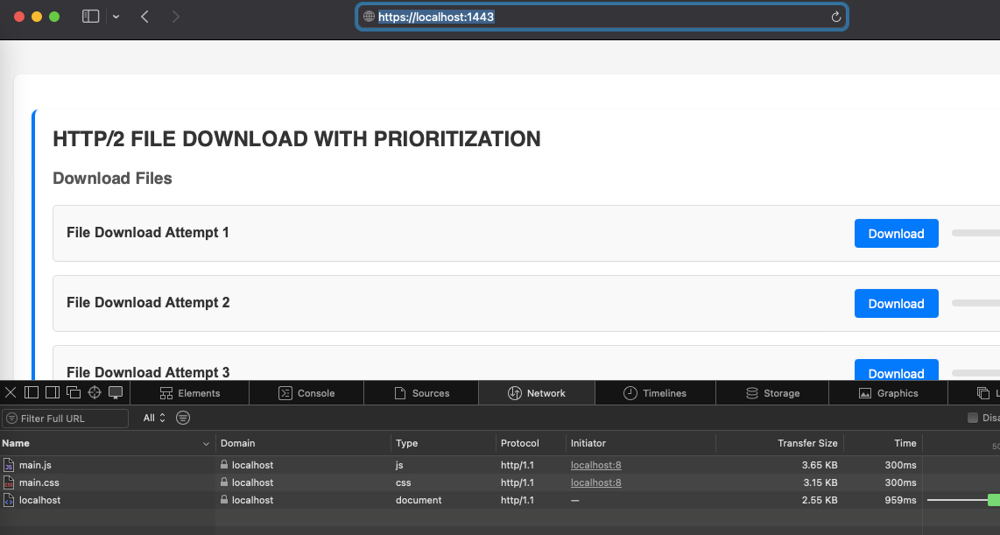
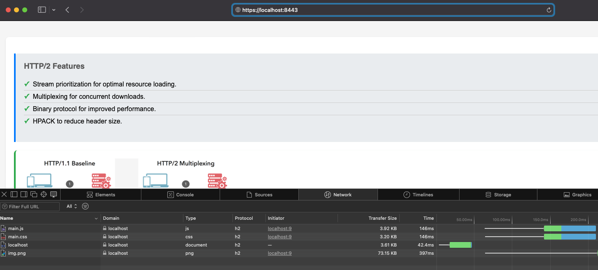

# Spring-boot Project to Demonstrate HTTP/2 Protocol.
Through this application I am going to demonstrate how to enable HTTP/2 protocol on Springboot application,   
and will try to demonstrate HTTP/2 protocol version capabilities over HTTP/1.1 protocol. 

## HTTP/2 over HTTP/1.1.
HTTP/2 offers significant performance advantages over HTTP/1.1 through, and it uses binary format for communication, which is more efficient for parsing and processing by computers.
- Multiplexing
- Header Compression
- Request Prioritization
- Connection Efficiency

### Multiplexing and Request Prioritization
- Multiple requests and responses can be sent concurrently over a single connection, eliminating head-of-line blocking found in HTTP/1.1.
- Each stream, request, or response can be prioritized, allowing critical resources to be delivered sooner.
- In contrast, HTTP/1.1 processes requests and responses sequentially, while HTTP/2 enables concurrent communication over a single connection.
- HTTP/2 replaces HTTP/1.1's chunked-transfer encoding with its own more efficient mechanism for data streaming.  

#### What is Head-Of-Line blocking
Head-of-line blocking is a performance bottleneck that occurs when a single delayed request or packet prevents others from being processed, even if they’re ready. It shows up in different layers of HTTP communication.   

**Let's understand through logs, below logs captured from both HTTP/1.1 and HTTP/2 Spring boot apps.**  

You can clearly see HTTP/1.1 using different connection for service each request and response, where in HTTP/2 logs same connection is being reused.  

#### HTTP/1.1 logs                                              
       

#### HTTP/2 logs


**Now, let's understand the Request Prioritization**  
[main.js](springboot-http2/src/main/resources/static/js/main.js) is where i am initiating remote http call from to the Springboot server, here is the piece of code with priority setting.
```html
    const fetchOptions = {
        method: 'GET',
        headers: {
            'Cache-Control': 'no-cache',
            'X-Stream-Priority': priority
        }
    };
```  
The priority is set as a numeric value, with lower numbers indicating higher priority.  
During testing, I started three parallel file download requests with priorities 1, 2, and 3; the request with priority 1 consistently completed first.  



**Using `rel=preload` in HTTP/2** to boost the static content loading.  
The rel="preload" attribute is an HTML resource hint that tells the browser: “This file is important—start fetching it now before it’s explicitly needed.”  

[index.html](springboot-http2/src/main/resources/templates/index.html)  

You can see the difference in loading time of static content here,
#### HTTP/1.1 browser devtools - network

#### HTTP/2 browser devtools - network


It takes advantage of HTTP/2 multiplexing, and loads resources in parallel.

- **Early Fetching:** It allows critical resources (like fonts, scripts, stylesheets, or images) to be downloaded early in the page lifecycle.  
- **Non-blocking:** These resources are fetched without blocking HTML parsing or rendering.  
- **Separation of Fetch & Execution:** You can preload a script but choose when to execute it later.

## Connection Efficiency  

While HTTP/1.1 processes requests and responses sequentially, HTTP/2 handles multiple concurrent streams on one connection.  

## Header Compression  
One of the major performance upgrades in HTTP/2 over HTTP/1.1 is how it handles header compression.  
HTTP/2 introduces a dedicated compression algorithm called **HPACK**, designed specifically for headers:  
- **Binary Encoding:** Headers are encoded in binary, making them smaller and faster to parse.  
- **Huffman Coding:** HPACK uses Huffman encoding to shrink individual header values efficiently.  
- **Header Tables:** Both client and server maintain dynamic tables of previously sent headers. If a header repeats, only a reference is sent instead of the full string

## Server Push
Enables server to proactively send resources to the client. - Deprecated in HTTP/3

# HTTP/3 features
- QUIC Protocol: HTTP/3 uses QUIC (officially introduced by google in 2021) as a transport layer network protocol which built on UDP.
- Connection Setup: HTTP/3 QUIC allows for faster connection establishment with 0-RTT (Zero - Round Trip Time) handshake, compared to the multi-round trip handshake by HTTP/1.1 and HTTP/2.
- Packet Loss Handling: Use of QUIC provides better resilience to Packet loss, minimizing the impact of performance.  
- Multiplexing: HTTP/3 uses QUIC for multiplexing, which is more resilient to head-of-line blocking.  
- Header Compression: HTTP/3 continue to use HPACK for compression.  

#### What is QUIC protocol by google.
QUIC (Quick UDP Internet Connections) is a modern transport layer protocol developed by Google and standardized by the IETF (RFC 9000).   
It’s designed to overcome the limitations of TCP and HTTP/2, especially around latency, security, and head-of-line blocking.  

**Traditional HTTP/2 runs over TCP, which:**
- Requires multiple round trips for connection setup (SYN, SYN-ACK, ACK, TLS handshake).
- Suffers from head-of-line blocking at the transport layer.
- Has slow recovery from packet loss due to in-order delivery guarantees.
**QUIC solves these by:**
- Using UDP instead of TCP.
- Integrating TLS 1.3 directly into the protocol.
- Supporting multiplexed streams without TCP’s limitations.
- It encrypts everything, including headers, making it harder for middleboxes to inspect traffic. 

# How to test the sample codes.

## Prerequisites
- Java 17 or above
- Maven
- HTTPS certificate (included: keystore.p12)
- 
## Enabling HTTP/2 in Spring Boot  
**Note:** 
- SSL Setup is mandatory to enable HTTP/2 protocol version. 
- Self-signed certificate is part of this repo, else create your own by fallowing below steps. HTTP/2 supports only TLS 1.2+
- HTTP/2 supports only TLS 1.2+

### Create Self-Signed Certificate using keytool.  

**Note:** make sure you are setting CN=localhost while creating SelfSigned cert.

```bash
keytool -genkeypair -alias tomcat -keyalg RSA -keysize 2048 -storetype PKCS12 -keystore src/main/resources/keystore.p12 -validity 365
```
### Importing the self-signed public cert to the Java keystore if we invoke the API from java client (optional).
````bash
openssl s_client -connect localhost:8443 -servername localhost < /dev/null | sed -ne '/-BEGIN CERTIFICATE-/,/-END CERTIFICATE-/p' > src/main/resources/public.crt

keytool -importcert -alias tomcat -file src/main/resources/public.crt -keystore "$JAVA_HOME/lib/security/cacerts" -storepass mysuperpassword
````

## Project structure.  

Sample project is a Maven multi-module project with two modules,  
- springboot-http1
- springboot-http2  

## Build and Run  

To build the entire project, run the below command in parent directory itself.  

```bash
    $cd http2-in-action
    $mvn clean install -U
```
Import the maven project to your favorite IDE, and run the below main classes to run the respective boot applications. 

- [Http1DemoApplication.java](springboot-http1/src/main/java/org/avol/springboot_http1/Http1DemoApplication.java)  
- [Http2DemoApplication.java](springboot-http2/src/main/java/org/avol/springboot_http2/Http2DemoApplication.java)  

Alternatively, navigate to each module directory and use the Maven Spring Boot plugin to start the server.

```bash
    $mvn springboot:run
```